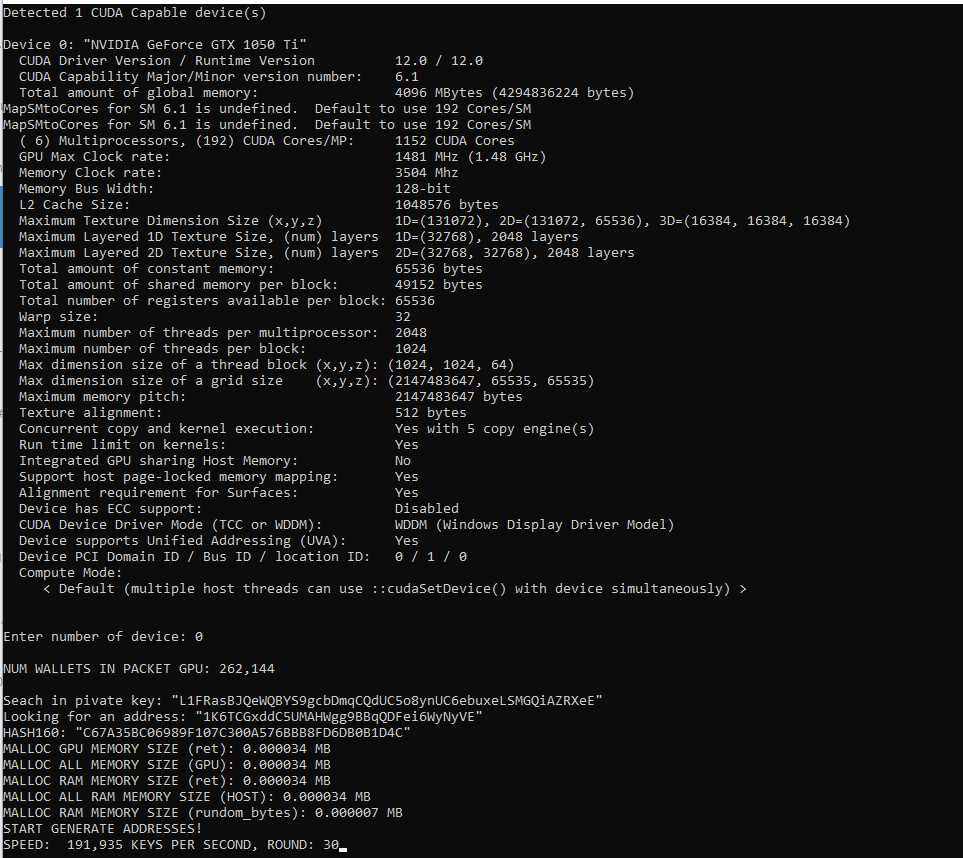

# Восстановление приватного ключа в WIF фортмате от bitcoin кошелька
Это первая программа из серии, для восстановления приватного ключа с потерянными символами на GPU. В следующих версиях будет добавляться новые возможности и более сложные алгоритмы, для увеличения скорости подбора символов. При достижении максимальной скорости алгоритма будет добавлена возможность восстановления полностью утраченного приватного ключа. Эта версия восстанавливает первые утраченные символы ключа в формате WIF.

## Файл config.cfg
* ***"cuda_grid": 256*** - настройка под видеокарту
* ***"cuda_block": 256*** - настройка под видеокарту\
(кол-во генерируемых ключей за один раунд равно cuda_grid*cuda_block)
* ***"num_symbols_find": 5*** - количество искомых символов
* ***"priv_key": "L1FRasBJQeWQBYS9gcbDmqCQdUC5o8ynUC6ebuxeLSMGQiAZRXeE"*** - искомый приватный ключь в формате WIF. Вместо искомых символов пишется любые символы, так чтоб длина ключа была 52 символа. Пример: *"WWWWWsBJQeWQBYS9gcbDmqCQdUC5o8ynUC6ebuxeLSMGQiAZRXeE"*
* ***"address": "1K6TCGxddC5UMAHWgg9BBqQDFei6WyNyVE"*** - адрес искомого кошелька.
## Описание программы
При запуске программы, считываются настройки из файла config.cfg.\
В консоли выводится надпись:\
*"Detected X CUDA Capable device(s)"*\
Где число X это количество найденных видеокарт NVIDIA.
Далее выводятся характеристики каждой карты:
> *Device 0: "NVIDIA GeForce GTX 1050 Ti"*\
> *...*\
> *Device 1: "NVIDIA GeForce GTX 1050 Ti"*\
> *...*\
> *Device 2: "NVIDIA GeForce GTX 1050 Ti"*\
> *...*

Ввести номер используемой видеокарты:
> *Enter number of device:*

Далее, в программе, адрес преобразуется в hash160. Символы ключа преобразуются в соответствующие номера Base58 (*pszBase58 = "123456789ABCDEFGHJKLMNPQRSTUVWXYZabcdefghijkmnopqrstuvwxyz"*). hash160 с дополнительными данными отправляется в постоянную память видеокарты. На CPU, в постоянном цикле, генерируются байты для поиска приватного ключа и запускается код на видеокарте. 

На GPU, к сгенерированному байтам прибавляется глобальный ID каждого потока. Что дает уникальный набор байтов для каждого потока. Этот набор байтов преобразуется в числа от 0 до 57, что соответствует номерам символов Base58. Далее в функции decode_base58_privkey приватный ключ декодируется в HEX-формат. после чего вычисляется публичный ключ (calc_public и hash160 (calc_hash160). Полученный hash160 сравнивается с хэшем искомого адреса.

Первый символ приватный ключ в формате WIF может быть только "K" или "L". Алгоритм преобразования WIF ключа в hash160 делается для "K" и "L" первого символа. 
## Если сгенерированный hash160 равен искомому
Приватный ключ (в HEX-формате) и адрес, будут сохранены в файл Found_Key.csv
В консоли появиться надписи
> *!!!FOUND!!!*\
> *!!!FOUND!!!*\
> *!!!FOUND!!!*\
> *!!!FOUND!!!*\
> *!!!FOUND KEY 783B31BC55571F69E34E021ED84B6FC592D1129B396E6CE8463D2E82A396872E FOR ADDRESS 1K6TCGxddC5UMAHWgg9BBqQDFei6WyNyVE*\
> *!!!FOUND!!!*\
> *!!!FOUND!!!*\
> *!!!FOUND!!!*\
> *!!!FOUND!!!*\

Где:\
*783B31BC55571F69E34E021ED84B6FC592D1129B396E6CE8463D2E82A396872E* - приватный ключ в формате HEX\
*1K6TCGxddC5UMAHWgg9BBqQDFei6WyNyVE* - адрес

## ОБСУЖДЕНИЕ КОДА: t.me/brute_force_gpu

